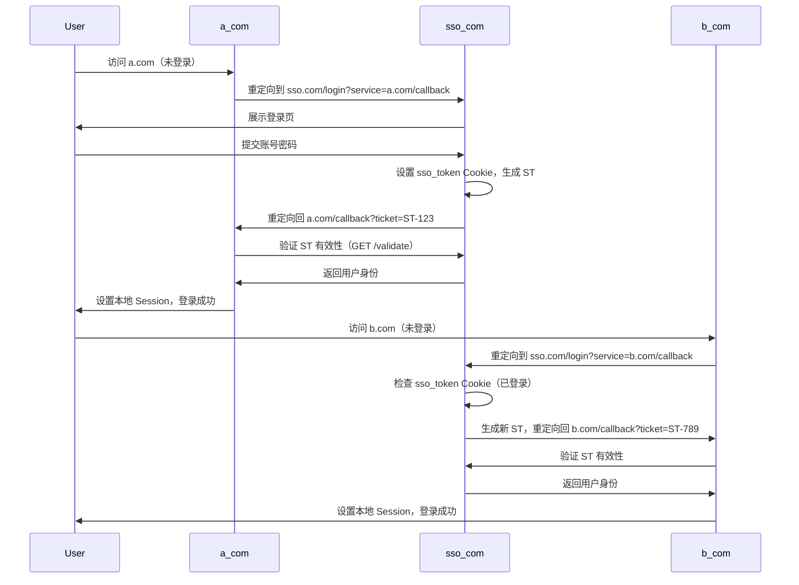

# SSO单点登录

> 单点登录(Single Sign-On, SSO)是一种身份认证技术，允许用户只需一次登录就可以访问多个相互信任的应用系统。

## 章节介绍

SSO单点登录是现代Web应用中重要的安全机制，广泛应用于企业系统、云服务和各类平台型产品中。本章将系统介绍SSO的核心概念、实现原理、常见协议及实战应用。

## 概念介绍

单点登录(SSO)是一种身份验证过程，允许用户使用一组凭据(用户名和密码)访问多个相关但独立的软件系统。其核心思想是在多个应用系统中，用户只需要登录一次，就可以访问所有相互信任的应用系统，而无需重复输入凭据。

### SSO的优势

- **提升用户体验**：减少登录次数，无需记忆多个账号密码
- **提高安全性**：集中管理认证过程，便于实施更强的安全策略
- **简化管理**：集中式用户管理，降低维护成本
- **便于扩展**：新应用加入SSO系统无需重新设计认证流程

### SSO的核心组件

1. **身份提供商(Identity Provider, IdP)**：负责验证用户身份并颁发认证凭证
2. **服务提供商(Service Provider, SP)**：依赖IdP进行身份验证的应用系统
3. **认证凭证**：通常是令牌(token)，证明用户已通过身份验证
4. **信任关系**：IdP与SP之间预先建立的信任机制

## 单点登录（SSO）跨域实现方案

## 一、核心问题背景
- **场景**：企业拥有两个独立域名系统 `a.com` 和 `b.com`，需实现用户只需登录一次即可访问两个系统的单点登录（SSO）。
- **核心挑战**：浏览器同源策略限制不同域名间的 Cookie 共享，需通过第三方认证中心解决身份传递问题。

---

## 二、SSO 核心原理
通过引入独立的**认证中心（SSO Server）**（如 `sso.com`），所有子系统（`a.com` 和 `b.com`）通过该中心验证用户身份。用户只需在 `sso.com` 登录一次，后续访问其他子系统时无需重复登录。

---

## 三、详细实现流程

### 1. 用户首次访问 `a.com`（未登录）
1. **`a.com` 检测本地无有效 Session**  
   - 重定向到 `sso.com` 的登录页，携带回调地址（`service` 参数）：  
     ```http
     GET `https://sso.com/login?service=https%3A%2F%2Fa.com%2Fcallback`  
     ```

2. **`sso.com` 处理登录请求**  
   - **情况1：`sso.com` 无 Cookie（用户未登录）**  
     - 展示登录页面，用户提交账号密码后验证：  
       ```javascript
       // sso.com 的登录接口（POST /do-login）
       app.post('/do-login', (req, res) => {
         const { username, password } = req.body;
         if (validateUser(username, password)) {
           // 1. 在 sso.com 的域下设置 Cookie（关键！）
           res.cookie('sso_token', 'abc123', { 
             domain: '.sso.com', // 允许所有子路径访问
             httpOnly: true,     // 防止 XSS
             secure: true        // 仅 HTTPS
           });
            
           // 2. 生成一次性服务票据（ST）
           const st = generateRandomToken();
           storeSTInCache(st, { userId: 123, username: 'user1' });
            
           // 3. 重定向回 a.com/callback，携带 ST
           res.redirect(`${req.query.service}?ticket=${st}`);
         }
       });
       ```
   - **情况2：`sso.com` 有 Cookie（用户已登录）**  
     - 直接生成新的 ST，重定向回 `a.com/callback`（跳过登录页）。

3. **`a.com` 验证 ST 并完成登录**  
   - 接收 `sso.com` 返回的 ST（如 `a.com/callback?ticket=ST-123`），向 `sso.com` 发起验证请求：  
     ```javascript
     // a.com 的回调接口（GET /callback）
     app.get('/callback', async (req, res) => {
       const { ticket } = req.query;
       const response = await fetch(`https://sso.com/validate?ticket=${ticket}`);
       const userData = await response.json(); // { userId: 123, username: 'user1' }
        
       if (userData) {
         req.session.user = userData; // 设置本地 Session
         res.send('登录成功！');
       }
     });
     ```

---

### 2. 用户访问 `b.com`（未登录）
1. **`b.com` 检测本地无 Session**  
   - 重定向到 `sso.com`，携带 `b.com` 的回调地址：  
     ```http
     GET `https://sso.com/login?service=https%3A%2F%2Fb.com%2Fcallback`  
     ```

2. **`sso.com` 发现已登录（关键步骤！）**  
   - **浏览器访问 `sso.com` 时自动携带 `sso_token` Cookie**（因域名匹配 `.sso.com`），`sso.com` 通过检查自己的 Cookie 发现用户已登录。  
   - 直接生成新的 ST，重定向回 `b.com/callback`（无需展示登录页）。

3. **`b.com` 验证 ST 并完成登录**  
   - 流程与 `a.com` 完全一致，最终设置本地 Session。

---

## 四、关键问题解答

### 问题1：为什么 `a.com/callback` 接收 ST 后还要向 `sso.com` 发起验证请求？
1. **防止伪造攻击**  
   - ST 是随机字符串，必须通过 `sso.com` 的权威验证才能确认其有效性，避免攻击者伪造 ST 欺骗系统。
2. **确保一次性使用**  
   - `sso.com` 在验证 ST 后会立即删除或标记为已使用，防止重复使用（防重放攻击）。

### 问题2：用户访问 `b.com` 时，`sso.com` 如何发现已登录？
1. **`sso.com` 的独立 Cookie**  
   - 用户首次登录 `a.com` 时，`sso.com` 在自己的域名下设置了 Cookie（如 `sso_token=abc123`）。  
   - 当用户访问 `b.com` 被重定向到 `sso.com` 时，浏览器会自动携带该 Cookie（同域名规则），`sso.com` 通过检查 Cookie 发现用户已登录。

2. **跨域隔离性**  
   - `a.com` 和 `b.com` 无法直接读取 `sso.com` 的 Cookie，但 `sso.com` 自己可以读取，从而判断用户是否已登录。

---

## 五、安全性设计

### 1. ST 的安全性
- **一次性使用**：验证后立即失效。
- **短期有效期**：通常 5 分钟内有效。
- **HTTPS 传输**：防止中间人劫持。

### 2. SSO Server 的 Cookie 安全
- **Domain 设置**：`.sso.com` 允许所有子路径访问。
- **HttpOnly + Secure**：防止 XSS 和明文传输。

### 3. 防 CSRF 措施
- 在回调接口中校验 `state` 参数（随机字符串），防止跨站请求伪造。

---

## 六、架构图解


## 实现原理

### SSO的基本流程

1. 用户访问服务提供商(SP)的应用系统
2. SP检测到用户未登录，重定向到身份提供商(IdP)
3. 用户在IdP进行身份验证
4. 验证通过后，IdP生成并返回认证凭证
5. SP验证凭证的有效性
6. 验证通过，允许用户访问应用系统
7. 用户后续访问其他SP时，无需重新登录

### 基于令牌的SSO实现

```javascript
## 跨域场景处理

在SSO实现中，当身份提供商(IdP)和服务提供商(SP)位于不同域名时，跨域资源共享(CORS)配置至关重要。以下是完整的跨域处理方案：

### CORS配置与跨域Cookie

#### 关键配置说明
- **origin**: 明确指定允许的SP域名，避免使用`*`通配符(与credentials不兼容)
- **credentials**: 必须设为true，允许跨域请求携带Cookie
- **withCredentials**: 客户端请求必须设置此属性为true
- **SameSite**: Cookie属性控制跨站请求携带策略，Lax模式是兼容性与安全性的平衡
- **domain**: 设置为父域名(如`.example.com`)可实现子域间Cookie共享

// SSO认证流程简化示例

// 1. 用户访问SP应用
app.get('/protected-resource', (req, res) => {
  if (!req.cookies.sso_token) {
    // 重定向到IdP进行认证
    const redirectUrl = `${idpUrl}/login?redirect=${encodeURIComponent(req.originalUrl)}`;
    return res.redirect(redirectUrl);
  }
  // 验证token
  verifyToken(req.cookies.sso_token)
    .then(user => {
      // token验证通过，允许访问资源
      res.render('protected-page', { user });
    })
    .catch(err => {
      // token无效，重定向到IdP
      res.redirect(`${idpUrl}/login?redirect=${encodeURIComponent(req.originalUrl)}`);
    });
});

// 2. IdP处理登录请求
app.post('/login', (req, res) => {
  const { username, password } = req.body;
  // 验证用户凭据
  authenticateUser(username, password)
    .then(user => {
      // 生成SSO令牌
      const ssoToken = generateToken(user);
      // 设置令牌cookie
      res.cookie('sso_token', ssoToken, {
  httpOnly: true, 
  secure: true,
  domain: '.example.com', // 主域名，允许子域共享
  sameSite: 'Lax', // 控制跨站请求携带Cookie
  maxAge: 3600000 // 1小时有效期
});
      // 重定向回SP应用
      res.redirect(req.query.redirect);
    })
    .catch(err => {
      res.render('login', { error: '用户名或密码错误' });
    });
});

// 3. 令牌验证函数
function verifyToken(token) {
  return new Promise((resolve, reject) => {
    // 验证令牌签名和有效期
    jwt.verify(token, ssoSecretKey, (err, decoded) => {
      if (err) return reject(err);
      resolve(decoded.user);
    });
  });
}
```

## 常见SSO协议

### 1. OAuth 2.0

OAuth 2.0是一个授权框架，而非严格意义上的认证协议，但常被用于实现SSO。

**核心角色**：
- 资源所有者(Resource Owner)
- 客户端(Client)
- 授权服务器(Authorization Server)
- 资源服务器(Resource Server)

**授权流程**：

```
+--------+                               +---------------+
|        |--(A)------- Authorization Request ----->|               |
|        |                               |               |
|        |<-(B)---- Authorization Grant ---------|               |
|        |                               | Authorization |
|        |--(C)------- Authorization Grant ----->|     Server    |
| Client |                               |               |
|        |<-(D)---- Access Token ----------------|               |
|        |                               +---------------+
|        |                                      |               |
|        |--(E)------- Access Token ----------->|               |
|        |                                      | Resource      |
|        |<-(F)---- Protected Resource ---------|     Server    |
+--------+                                      +---------------+
```

**OAuth 2.0实现示例**：

```javascript
// 客户端请求授权
const authUrl = `${authServer}/authorize?` + new URLSearchParams({
  response_type: 'code',
  client_id: 'CLIENT_ID',
  redirect_uri: 'https://client.example.com/callback',
  scope: 'read write',
  state: 'random_state_value'
});

// 授权服务器回调处理
app.get('/callback', async (req, res) => {
  const { code, state } = req.query;
  
  // 验证state
  if (state !== storedState) {
    return res.status(403).send('State mismatch');
  }
  
  // 用授权码换取访问令牌
  const tokenResponse = await fetch(`${authServer}/token`, {
    method: 'POST',
    headers: {
      'Content-Type': 'application/x-www-form-urlencoded',
      'Authorization': `Basic ${btoa(`${clientId}:${clientSecret}`)}`
    },
    body: new URLSearchParams({
      grant_type: 'authorization_code',
      code,
      redirect_uri: 'https://client.example.com/callback'
    })
  });
  
  const { access_token, refresh_token } = await tokenResponse.json();
  
  // 使用访问令牌访问资源
  const resourceResponse = await fetch(`${resourceServer}/api/data`, {
    headers: {
      'Authorization': `Bearer ${access_token}`
    }
  });
  
  const data = await resourceResponse.json();
  res.render('data', { data });
});
```

### 2. SAML 2.0

安全断言标记语言(SAML)是一个基于XML的开放标准，专为身份提供商和服务提供商之间交换身份验证和授权数据而设计。

**SAML的优势**：
- 专为企业级SSO设计
- 强大的身份属性传递能力
- 广泛的企业软件支持

**SAML流程**：
1. 用户尝试访问SP
2. SP生成SAML请求
3. 用户被重定向到IdP
4. 用户在IdP进行身份验证
5. IdP生成SAML响应(包含用户身份信息)
6. 用户被重定向回SP
7. SP验证SAML响应
8. 用户被授予访问权限

### 3. OpenID Connect (OIDC)

OIDC是建立在OAuth 2.0之上的身份层，提供了简单的身份验证和用户信息获取机制。

**OIDC核心概念**：
- ID令牌(ID Token)：JWT格式的身份令牌
- 用户信息端点(UserInfo Endpoint)：提供用户详细信息
- 发现端点(Discovery Endpoint)：提供OIDC配置信息

**OIDC实现优势**：
- 基于JSON而非XML，更适合Web应用
- 简化的开发流程
- 良好的移动应用支持
- 内置的用户信息获取机制

## 实战案例

### 企业内部系统SSO实现

假设某企业有多个内部系统(HR系统、财务系统、项目管理系统)，需要实现SSO：

1. **搭建统一身份认证平台**(IdP)
   - 基于Keycloak或自研认证系统
   - 支持多种认证方式(密码、双因素、生物识别)
   - 集中式用户管理

2. **应用系统集成**(SP)
   - 旧系统：使用代理模式集成
   - 新系统：原生支持OIDC/OAuth2.0
   - 非Web系统：使用API密钥或令牌

3. **实现单点登出**
   - 前端：清除本地会话
   - 后端：使令牌失效
   - 通知：向所有已登录应用发送登出通知

### 代码示例：Node.js实现简单SSO服务

```javascript
// sso-server.js - 简单的SSO服务器实现
const express = require('express');
const jwt = require('jsonwebtoken');
const cookieParser = require('cookie-parser');
const cors = require('cors');

const app = express();
app.use(express.json());
app.use(cookieParser());
// 配置CORS以支持跨域请求
app.use(cors({
  origin: ['https://app1.example.com', 'https://app2.example.com'], // 明确指定允许的SP域名
  credentials: true, // 允许跨域请求携带Cookie
  methods: ['GET', 'POST', 'OPTIONS'],
  allowedHeaders: ['Content-Type', 'Authorization'],
  exposedHeaders: ['Set-Cookie'], // 允许客户端访问的响应头
  maxAge: 86400 // 预检请求缓存时间(秒)
}));
// 处理预检请求
app.options('*', cors());

// 配置
const SSO_SECRET = 'your-sso-secret-key';
const SSO_DOMAIN = 'sso.example.com';
const TRUSTED_SPs = [
  'https://app1.example.com',
  'https://app2.example.com',
  'https://app3.example.com'
];

// 用户数据库(实际应用中应使用数据库)
const users = [
  { id: 1, username: 'admin', password: 'password123', roles: ['admin'] },
  { id: 2, username: 'user', password: 'password456', roles: ['user'] }
];

// 验证SP是否可信
const isTrustedSP = (spUrl) => TRUSTED_SPs.includes(spUrl);

// 登录端点
app.post('/login', (req, res) => {
  const { username, password, redirectUri } = req.body;

  // 验证重定向URI
  if (!redirectUri || !isTrustedSP(new URL(redirectUri).origin)) {
    return res.status(400).json({ error: 'Invalid redirect URI' });
  }

  // 验证用户凭据
  const user = users.find(u => u.username === username && u.password === password);
  if (!user) {
    return res.status(401).json({ error: 'Invalid credentials' });
  }

  // 生成SSO令牌
  const ssoToken = jwt.sign(
    { userId: user.id, username: user.username, roles: user.roles },
    SSO_SECRET,
    { expiresIn: '1h' }
  );

  // 设置SSO令牌cookie
  res.cookie('sso_token', ssoToken, {
    httpOnly: true,
    secure: true,
    domain: SSO_DOMAIN,
    maxAge: 3600000
  });

  // 重定向回SP
  res.json({ redirectUri });
});

// 验证令牌端点
app.post('/validate-token', (req, res) => {
  const { token } = req.body;
  const { origin } = req.headers;

  // 验证请求来源
  if (!origin || !isTrustedSP(origin)) {
    return res.status(403).json({ error: 'Unauthorized origin' });
  }

  try {
    // 验证令牌
    const decoded = jwt.verify(token, SSO_SECRET);
    res.json({ valid: true, user: decoded });
  } catch (err) {
    res.json({ valid: false, error: 'Invalid or expired token' });
  }
});

// 登出端点
app.post('/logout', (req, res) => {
  // 清除SSO令牌cookie
  res.clearCookie('sso_token', {
    httpOnly: true,
    secure: true,
    domain: SSO_DOMAIN
  });
  res.json({ success: true, message: 'Logged out successfully' });
});

// 启动服务器
const PORT = 3000;
app.listen(PORT, () => {
  console.log(`SSO Server running on port ${PORT}`);
});
```

### SP应用集成示例

```javascript
// SP应用集成SSO客户端代码
const express = require('express');
const jwt = require('jsonwebtoken');
const cookieParser = require('cookie-parser');
const axios = require('axios');

const app = express();
app.use(express.json());
app.use(cookieParser());

// 配置
const SSO_SERVER = 'https://sso.example.com';
const SP_URL = 'https://app1.example.com';
const SP_SECRET = 'app1-secret-key';

// 受保护路由中间件
const requireAuth = async (req, res, next) => {
  try {
    // 检查本地会话
    if (req.cookies.sp_session) {
      const session = jwt.verify(req.cookies.sp_session, SP_SECRET);
      req.user = session.user;
      return next();
    }

    // 检查SSO令牌
    if (!req.cookies.sso_token) {
      // 重定向到SSO登录
      return res.redirect(`${SP_URL}/login`);
    }

    // 验证SSO令牌
    const response = await axios.post(`${SSO_SERVER}/validate-token`, {
      token: req.cookies.sso_token
    }, {
      headers: { 'Origin': SP_URL },
withCredentials: true // 允许跨域请求携带Cookie
    });

    if (response.data.valid) {
      // 创建本地会话
      const spSession = jwt.sign(
        { user: response.data.user },
        SP_SECRET,
        { expiresIn: '1h' }
      );

      // 设置本地会话cookie
      res.cookie('sp_session', spSession, {
        httpOnly: true,
        secure: true,
        maxAge: 3600000
      });

      req.user = response.data.user;
      next();
    } else {
      // 令牌无效，重定向到登录
      res.redirect(`${SP_URL}/login`);
    }
  } catch (err) {
    res.redirect(`${SP_URL}/login`);
  }
};

// SP登录页面
app.get('/login', (req, res) => {
  res.send(`
    <html>
      <body>
        <h1>企业统一登录</h1>
        <button onclick="window.location.href='${SSO_SERVER}/login-page?redirect=${SP_URL}'">
          使用企业账号登录
        </button>
      </body>
    </html>
  `);
});

// 受保护资源
app.get('/dashboard', requireAuth, (req, res) => {
  res.send(`
    <html>
      <body>
        <h1>欢迎, ${req.user.username}!</h1>
        <p>您的角色: ${req.user.roles.join(', ')}</p>
        <a href="/logout">退出登录</a>
      </body>
    </html>
  `);
});

// 登出
app.get('/logout', async (req, res) => {
  // 清除本地会话
  res.clearCookie('sp_session');

  // 调用SSO登出
  try {
    await axios.post(`${SSO_SERVER}/logout`, {}, {
      headers: { 'Origin': SP_URL },
      withCredentials: true
    });
  } catch (err) {
    console.error('SSO logout failed:', err);
  }

  res.redirect('/login');
});

// 启动服务器
const PORT = 3001;
app.listen(PORT, () => {
  console.log(`SP App running on port ${PORT}`);
});
```

## SSO安全考量

### 1. 令牌安全

- 使用安全的令牌传输方式(HTTPS)
- 设置适当的令牌过期时间
- 实现令牌撤销机制
- 使用不可预测的令牌值
- 考虑使用短期访问令牌+长期刷新令牌模式

### 2. 防止常见攻击

- **重定向攻击**：严格验证重定向URI
- **CSRF攻击**：使用CSRF令牌
- **XSS攻击**：实施内容安全策略(CSP)，避免存储敏感信息在localStorage
- **中间人攻击**：强制使用HTTPS，实施证书固定

### 3. 最佳安全实践

- 实施多因素认证(MFA)
- 采用最小权限原则
- 实施会话超时机制
- 记录和监控认证事件
- 定期安全审计和渗透测试

## 面试常见问题

### 问题1: 请解释SSO的工作原理及其优缺点

**参考答案**：
SSO(单点登录)是一种身份认证技术，允许用户只需一次登录就能访问多个相互信任的应用系统。

**工作原理**：
1. 用户访问服务提供商(SP)应用
2. SP将用户重定向到身份提供商(IdP)
3. 用户在IdP进行身份验证
4. IdP颁发认证凭证(通常是令牌)
5. 用户被重定向回SP
6. SP验证凭证并授予访问权限

**优点**：
- 提升用户体验，减少登录次数
- 集中管理认证，提高安全性
- 简化用户管理，降低维护成本
- 便于新应用集成

**缺点**：
- IdP成为单点故障点
- 初始实施复杂度高
- 一旦IdP被攻破，所有关联系统都面临风险
- 不同系统间的兼容性问题

### 问题2: OAuth 2.0和SAML有什么区别？各自适用场景是什么？

**参考答案**：

**技术差异**：
- **数据格式**：OAuth 2.0使用JSON，SAML使用XML
- **流程复杂度**：OAuth 2.0相对简单，SAML较复杂
- **扩展性**：OAuth 2.0更灵活，扩展性更好
- **成熟度**：SAML出现更早，企业级支持更成熟

**适用场景**：
- **OAuth 2.0**：
  - 第三方应用授权(如"使用微信登录")
  - 移动应用和现代Web应用
  - API访问授权
  - 简单的SSO实现

- **SAML**：
  - 企业级SSO
  - 需要复杂身份属性传递的场景
  - 与传统企业系统集成
  - 对安全性要求极高的政府或金融领域

### 问题3: 如何设计一个高可用的SSO系统？

**参考答案**：
设计高可用SSO系统需考虑以下几点：

1. **冗余部署**：
   - IdP集群部署，避免单点故障
   - 地理分布式部署，提高灾难恢复能力
   - 负载均衡，分配流量

2. **性能优化**：
   - 令牌验证缓存
   - 会话信息集中存储(如Redis)
   - 异步处理非关键流程

3. **容错机制**：
   - 降级策略(如允许有限访问)
   - 会话持久化
   - 自动故障转移

4. **安全保障**：
   - 多因素认证
   - 异常检测
   - 令牌快速撤销机制
   - 防DDoS攻击措施

5. **监控与告警**：
   - 实时监控系统健康状态
   - 关键指标告警
   - 用户体验监控

6. **灾备与恢复**：
   - 定期备份
   - 恢复演练
   - 明确的故障处理流程

### 问题4: SSO实现中如何处理跨域问题？

**参考答案**：
SSO中的跨域问题主要涉及跨域资源共享(CORS)和跨域Cookie传递，解决方案包括：

1. **CORS配置**：
   ```javascript
   // IdP端配置
   app.use(cors({
     origin: ['https://app1.example.com', 'https://app2.example.com'], // 明确指定允许的SP域名
     credentials: true, // 允许跨域请求携带Cookie
     methods: ['GET', 'POST', 'OPTIONS'],
     allowedHeaders: ['Content-Type', 'Authorization'],
     exposedHeaders: ['Set-Cookie'],
     maxAge: 86400
   }));
   ```

2. **跨域Cookie设置**：
   ```javascript
   res.cookie('sso_token', ssoToken, {
     httpOnly: true, 
     secure: true,
     domain: '.example.com', // 父域名共享
     sameSite: 'Lax', // 平衡兼容性与安全性
     maxAge: 3600000
   });
   ```

3. **客户端请求配置**：
   ```javascript
   // 客户端fetch请求
   fetch('https://idp.example.com/validate-token', {
     method: 'POST',
     credentials: 'include', // 关键：允许跨域请求携带Cookie
     headers: {
       'Content-Type': 'application/json',
       'Origin': 'https://app1.example.com'
     },
     body: JSON.stringify({ token: '...' })
   });
   ```

4. **SameSite Cookie策略**：
   - `SameSite: Strict`：完全禁止跨站Cookie携带
   - `SameSite: Lax`：允许GET请求携带
   - `SameSite: None`：需要配合Secure属性使用

### 问题5: 什么是JWT？在SSO中如何使用JWT？

**参考答案**：
JWT(JSON Web Token)是一种紧凑的、URL安全的方式，用于表示在双方之间传递的声明。JWT由三部分组成：头部(Header)、载荷(Payload)和签名(Signature)。

**在SSO中的应用**：
1. 用户在IdP认证成功后，IdP生成JWT令牌
2. JWT包含用户身份信息和权限声明
3. IdP将JWT返回给用户浏览器或客户端
4. 客户端在后续请求中携带JWT
5. SP验证JWT的签名和有效性
6. 验证通过后，SP根据JWT中的声明授予用户相应权限

**JWT用于SSO的优势**：
- 自包含：无需查询数据库即可验证用户身份
- 无状态：减轻服务器存储负担
- 跨域支持：适合分布式系统
- 紧凑：便于在URL、Cookie和HTTP头部中传输

**注意事项**：
- JWT不可修改，但信息是明文编码的，不应包含敏感信息
- 应设置合理的过期时间
- 确保签名密钥安全
- 实现有效的令牌撤销机制

## 跨域实现注意事项

### 浏览器兼容性问题
- **SameSite属性**：在IE和旧版浏览器中不被支持，可能需要降级方案
- **预检请求**：某些浏览器对复杂请求会发送OPTIONS预检请求
- **第三方Cookie**：部分浏览器默认阻止第三方Cookie(如Safari)

### 安全性权衡
- **origin验证**：必须严格验证来源，避免恶意网站伪造请求
- **HTTPS依赖**：跨域Cookie和secure属性依赖HTTPS环境
- **CSRF防护**：即使使用SSO，仍需在各SP端实施CSRF防护

## 扩展思考

1. **SSO与联邦身份管理(Federated Identity Management)有何区别与联系？**
   SSO是联邦身份管理的一部分，关注单点登录体验；而联邦身份管理更广泛，涉及跨组织的身份信息共享和信任机制。

2. **移动应用如何实现SSO？**
   移动应用通常使用隐式授权流程或PKCE(Proof Key for Code Exchange)流程，将令牌存储在安全的移动应用存储区域，如Keychain(iOS)或Keystore(Android)。

3. **无密码认证如何与SSO结合？**
   可以将生物识别、硬件令牌或基于电子邮件的一次性链接等无密码认证方式作为IdP的认证手段，增强SSO系统的安全性。

4. **SSO在微服务架构中的挑战与解决方案？**
   挑战包括服务间信任建立、令牌传递和验证性能。解决方案包括使用API网关集中处理认证、采用轻量级令牌(JWT)和实现令牌验证缓存。