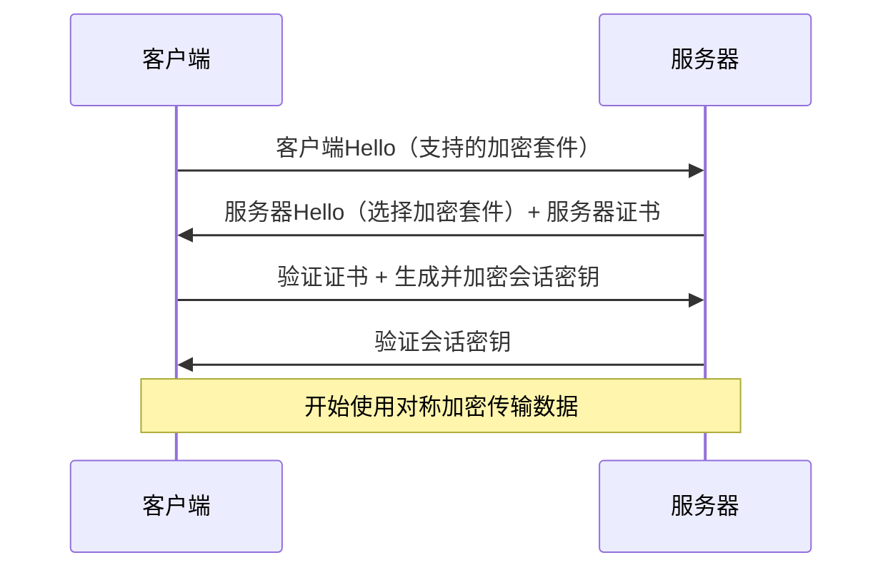

# 中间人攻击与HTTPS安全机制

## 概念介绍
中间人攻击（Man-in-the-Middle Attack, MITM）是一种常见的网络攻击方式，攻击者在通信双方之间插入自己的设备或程序，拦截、篡改或窃取通信内容，而通信双方却无法察觉攻击者的存在。

HTTPS（Hypertext Transfer Protocol Secure）是HTTP的安全版本，通过引入加密机制和身份验证，有效防范中间人攻击，确保数据传输的机密性、完整性和真实性。

## 中间人攻击的工作原理

### 攻击流程
1. **拦截通信**：攻击者位于客户端和服务器之间，拦截所有通信流量
2. **伪装身份**：攻击者分别向客户端伪装成服务器，向服务器伪装成客户端
3. **数据操控**：窃取敏感信息、篡改传输内容或注入恶意代码
4. **隐蔽存在**：在不中断通信的情况下完成攻击，使双方无法察觉

### 常见攻击场景
- 公共Wi-Fi环境下的流量监听
- 恶意软件修改本地网络设置
- 不安全的代理服务器
- DNS劫持或ARP欺骗

## HTTPS如何提升安全性

### 1. 数据加密机制
HTTPS采用**混合加密体系**保障数据安全：

#### 对称加密
- 使用相同密钥进行加密和解密
- 加密速度快，适合大量数据传输
- 例如：AES算法

#### 非对称加密
- 使用公钥加密，私钥解密
- 解决密钥交换问题
- 例如：RSA或ECC算法

#### HTTPS加密流程


### 2. 身份验证与证书机制

#### 数字证书
- 由可信第三方CA（证书颁发机构）签发
- 包含服务器公钥、域名、有效期等信息
- 防止攻击者伪造公钥

#### 证书验证流程
1. 客户端验证证书签名是否有效
2. 检查证书是否在有效期内
3. 验证证书链完整性
4. 确认证书中的域名与访问域名一致

### 3. 完整性校验
- 使用消息认证码（MAC）或哈希函数
- 确保数据在传输过程中未被篡改
- 例如：SHA-256哈希算法

## HTTPS安全配置最佳实践

### 服务器配置
```nginx
# Nginx配置示例
server {
    listen 443 ssl;
    server_name example.com;

    ssl_certificate /path/to/cert.pem;
    ssl_certificate_key /path/to/key.pem;
    ssl_protocols TLSv1.2 TLSv1.3;
    ssl_prefer_server_ciphers on;
    ssl_ciphers 'ECDHE-ECDSA-AES256-GCM-SHA384:ECDHE-RSA-AES256-GCM-SHA384';
    ssl_session_timeout 1d;
    ssl_stapling on;
    ssl_stapling_verify on;
}
```

### 前端安全措施
```javascript
// 强制使用HTTPS（前端代码）
if (window.location.protocol !== 'https:') {
    window.location.href = 'https:' + window.location.href.substring(window.location.protocol.length);
}

// 检测证书错误（仅在特定环境下可用）
window.addEventListener('securitypolicyviolation', (e) => {
    console.error('Security Policy Violation:', e);
});
```

## 面试常见问题

### 问题1：HTTP和HTTPS的主要区别是什么？
**解答**：
1. **安全性**：HTTP明文传输，HTTPS加密传输
2. **端口**：HTTP使用80端口，HTTPS使用443端口
3. **开销**：HTTPS需要握手过程，开销更大
4. **证书**：HTTPS需要CA证书，HTTP不需要
5. **状态**：HTTP无状态，HTTPS在HTTP基础上添加了TLS/SSL层

### 问题2：HTTPS如何防止中间人攻击？
**解答**：HTTPS通过以下机制防止中间人攻击：
1. **证书验证**：客户端验证服务器证书的合法性
2. **非对称加密**：确保初始密钥交换安全
3. **会话密钥**：每次会话生成唯一的会话密钥
4. **完整性校验**：防止数据被篡改
5. **证书链**：建立可信的证书颁发机构体系

### 问题3：TLS握手过程详细描述
**解答**：TLS握手过程主要包括：
1. **客户端Hello**：发送支持的TLS版本、加密套件列表和随机数
2. **服务器Hello**：选择TLS版本和加密套件，发送服务器随机数
3. **证书发送**：服务器发送数字证书
4. **密钥交换**：客户端验证证书后，生成预主密钥并用服务器公钥加密发送
5. **会话密钥生成**：双方使用客户端随机数、服务器随机数和预主密钥生成会话密钥
6. **握手完成**：双方确认使用会话密钥进行加密通信

### 问题4：什么是证书链？它如何增强安全性？
**解答**：证书链是由多级CA组成的信任体系：
1. 根CA签发中间CA证书
2. 中间CA签发服务器证书
3. 客户端只需信任根CA，即可信任由其签发的所有证书
4. 增强了证书体系的可扩展性和安全性
5. 即使某个中间CA被攻破，根CA可撤销其证书

## 中间人攻击防御措施
1. **使用HTTPS**：全站HTTPS，设置HSTS头部
2. **证书验证**：客户端严格验证证书有效性
3. **安全配置**：禁用不安全的TLS版本和加密套件
4. **监控告警**：建立异常流量监控机制
5. **网络隔离**：避免使用不安全的公共网络
6. **安全意识**：警惕钓鱼网站和可疑链接

## 总结
HTTPS通过加密传输、身份验证和完整性校验三大机制，有效防范中间人攻击等安全威胁。作为前端开发者，理解HTTPS原理不仅有助于构建更安全的应用，也是面试中的常见考点。在实际开发中，应始终遵循安全最佳实践，确保用户数据传输安全。