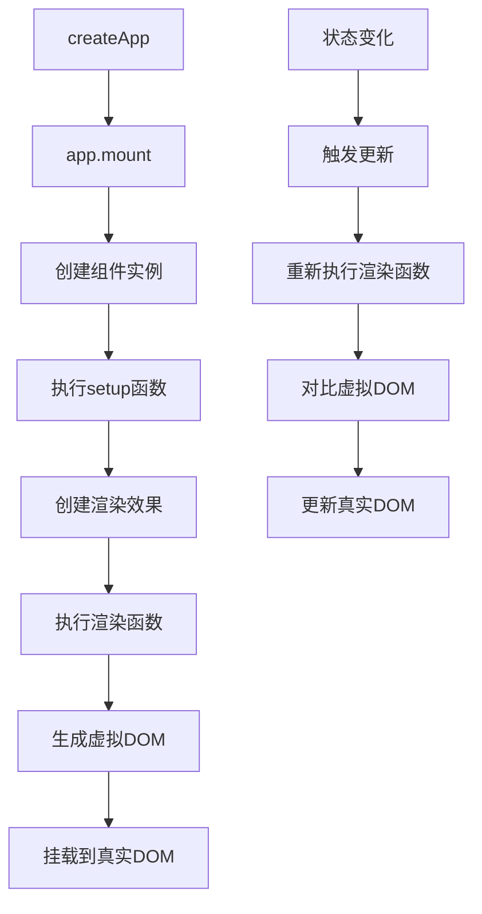

# Vue3核心概念与架构

> Vue3是一个渐进式的JavaScript框架，采用全新架构设计，以更好的性能、更小的体积和更好的TypeScript支持为核心目标。本文深入剖析Vue3的架构设计与核心概念。

## 概念介绍

Vue3是Vue.js的最新主要版本，由Vue.js团队于2020年9月正式发布。它保持了Vue渐进式框架的特点，同时通过重写核心算法和采用新的架构，提供了更好的性能、更小的打包体积以及优秀的TypeScript支持。Vue3采用Composition API作为核心特性，使代码组织更加灵活，提高了代码的可重用性。

## 整体架构

Vue3采用了模块化的架构设计，将核心功能拆分为独立的包，形成一个Monorepo结构。这种架构使得Vue3在保持核心功能轻量的同时，也能够支持更多高级特性。

### 核心架构图

```
Vue3架构
├── 编译器（Compiler）
│   ├── 模板编译器 (Template Compiler) - 将模板字符串编译为渲染函数
│   └── 渲染函数编译器 (Render Function Compiler) - 优化静态节点提升性能
├── 运行时（Runtime）
│   ├── 响应式系统 (Reactivity System) - 基于Proxy实现的细粒度响应式
│   ├── 渲染器 (Renderer) - 负责将虚拟DOM转换为真实DOM
│   └── 调度器 (Scheduler) - 控制副作用的执行时机
├── 共享层（Shared）
│   ├── 工具函数 (Utils) - 通用辅助方法
│   └── 类型定义 (TypeScript Types) - 完整的类型声明
```

## 核心特性

### 1. 响应式系统

Vue3的响应式系统基于ES6的Proxy实现，相比Vue2的Object.defineProperty，支持：
- 深层响应式（无需Vue.set）
- 数组索引和属性的响应式
- Symbol类型属性的响应式

```javascript
// 响应式对象创建示例
import { reactive } from 'vue'
const state = reactive({ count: 0 })
state.count++ // 触发依赖更新
```

### 2. Composition API

通过setup函数和组合式函数（Composables）实现逻辑复用，解决Options API中逻辑分散的问题：

```javascript
// 使用组合式函数封装计数器逻辑
import { ref, onMounted } from 'vue'
function useCounter() {
  const count = ref(0)
  const increment = () => count.value++
  onMounted(() => console.log('Counter mounted'))
  return { count, increment }
}
```

### 主要模块及功能

Vue3的核心包括以下几个主要模块：

1. **响应式系统（@vue/reactivity）**：
   - 使用Proxy替代Object.defineProperty实现响应式
   - 提供ref、reactive、computed、watch等API
   - 可以独立于Vue框架使用

2. **编译器（@vue/compiler-dom, @vue/compiler-core）**：
   - 将模板编译为渲染函数
   - 支持静态提升和树摇（Tree-shaking）
   - 实现基于块（Block）的编译优化

3. **运行时核心（@vue/runtime-core）**：
   - 虚拟DOM实现
   - 组件系统
   - 渲染器接口

4. **DOM渲染器（@vue/runtime-dom）**：
   - 基于运行时核心
   - 处理DOM特定的操作

5. **服务端渲染（@vue/server-renderer）**：
   - 支持服务端渲染
   - 支持流式渲染

## 核心特性

### 1. Composition API

Composition API是Vue3最重要的特性之一，它通过函数式的API设计，解决了Options API中的代码组织问题。

```javascript
/**
 * @description 使用Composition API实现一个简单的计数器
 */
import { ref, onMounted, onUnmounted } from 'vue'

export function useCounter() {
  // 声明响应式状态
  const count = ref(0)

  // 方法
  function increment() {
    count.value++
  }

  function decrement() {
    count.value--
  }

  // 生命周期钩子
  onMounted(() => {
    console.log('计数器组件已挂载')
  })

  onUnmounted(() => {
    console.log('计数器组件已卸载')
  })

  // 暴露状态和方法
  return {
    count,
    increment,
    decrement
  }
}
```

在组件中使用：

```vue
<template>
  <div>
    <p>当前计数: {{ count }}</p>
    <button @click="increment">增加</button>
    <button @click="decrement">减少</button>
  </div>
</template>

<script setup>
import { useCounter } from './useCounter'

// 直接在组件中使用组合式函数
const { count, increment, decrement } = useCounter()
</script>
```

### 2. 响应式系统

Vue3使用Proxy代替Vue2中的Object.defineProperty，提供真正的响应式能力：

```javascript
/**
 * @description Vue3响应式系统核心实现原理示例
 */
function reactive(target) {
  return new Proxy(target, {
    get(target, key, receiver) {
      // 跟踪依赖
      track(target, key)

      const value = Reflect.get(target, key, receiver)
      // 如果值是对象，递归转换为响应式
      return typeof value === 'object' ? reactive(value) : value
    },
    set(target, key, value, receiver) {
      const oldValue = target[key]
      const result = Reflect.set(target, key, value, receiver)

      if (oldValue !== value) {
        // 触发更新
        trigger(target, key, value)
      }

      return result
    }
  })
}
```

### 3. 单文件组件与setup语法糖

Vue3引入了`<script setup>`语法糖，简化组件编写：

```vue
<template>
  <div>
    <h1>{{ title }}</h1>
    <p>{{ count }}</p>
    <button @click="increment">增加</button>
  </div>
</template>

<script setup>
import { ref, onMounted } from 'vue'

// 声明响应式状态
const title = 'Vue3组件'
const count = ref(0)

// 方法
function increment() {
  count.value++
}

// 生命周期钩子
onMounted(() => {
  console.log('组件已挂载')
})
</script>

<style scoped>
h1 {
  color: #42b883;
}
</style>
```

### 4. Teleport组件

Teleport允许将组件的一部分内容渲染到DOM的不同位置：

```vue
<template>
  <div>
    <h1>主内容</h1>

    <Teleport to="body">
      <!-- 这部分内容将被渲染到body标签下 -->
      <div class="modal">
        <h2>模态框标题</h2>
        <p>模态框内容...</p>
        <button @click="closeModal">关闭</button>
      </div>
    </Teleport>
  </div>
</template>
```

### 5. Fragments

Vue3组件可以有多个根节点：

```vue
<template>
  <!-- 不再需要单一根节点包裹 -->
  <header>页头</header>
  <main>主内容</main>
  <footer>页脚</footer>
</template>
```

### 6. 静态提升与树摇优化

Vue3在编译阶段进行静态内容提升，减少运行时开销：

```vue
<template>
  <div>
    <h1>静态标题</h1>
    <p>{{ dynamicContent }}</p>
  </div>
</template>
```

编译后的渲染函数(伪代码)：

```javascript
// 静态内容被提升到渲染函数之外
const _hoisted_1 = /*#__PURE__*/createElementVNode("h1", null, "静态标题", -1)

export function render(_ctx, _cache) {
  return (openBlock(), createElementBlock("div", null, [
    _hoisted_1,
    createElementVNode("p", null, toDisplayString(_ctx.dynamicContent), 1)
  ]))
}
```

## 实战案例

### 创建一个Vue3应用

```javascript
/**
 * @description 创建Vue3应用示例
 * @file main.js
 */
import { createApp } from 'vue'
import App from './App.vue'
import router from './router'
import store from './store'

// 创建应用实例
const app = createApp(App)

// 注册插件
app.use(router)
app.use(store)

// 全局配置
app.config.errorHandler = (err) => {
  console.error('全局错误:', err)
}

// 全局属性
app.config.globalProperties.$api = {
  baseURL: 'https://api.example.com'
}

// 挂载应用
app.mount('#app')
```

### 组合式函数(Composables)

```javascript
/**
 * @description 实现一个鼠标位置跟踪的组合式函数
 * @file useMousePosition.js
 */
import { ref, onMounted, onUnmounted } from 'vue'

export function useMousePosition() {
  const x = ref(0)
  const y = ref(0)

  function update(event) {
    x.value = event.pageX
    y.value = event.pageY
  }

  onMounted(() => {
    window.addEventListener('mousemove', update)
  })

  onUnmounted(() => {
    window.removeEventListener('mousemove', update)
  })

  return { x, y }
}
```

使用示例：

```vue
<template>
  <div>
    鼠标位置：X: {{ x }}, Y: {{ y }}
  </div>
</template>

<script setup>
import { useMousePosition } from './useMousePosition'

const { x, y } = useMousePosition()
</script>
```

## 兼容性说明

Vue3要求支持ES2015(ES6)的浏览器，不再支持IE11及以下版本。主要的兼容性要求如下：

| 浏览器             | 最低支持版本 |
|------------------|------------|
| Chrome           | 64+        |
| Firefox          | 78+        |
| Safari           | 12+        |
| Edge             | 79+        |
| Opera            | 51+        |
| iOS Safari       | 12.2+      |
| Android Chrome   | 64+        |

如果需要支持IE11，可以继续使用Vue2，或者使用官方兼容性构建版本(需要额外的兼容性代码)。

## 面试常见问题

### Vue3与Vue2的主要区别是什么？

**答**：Vue3与Vue2相比有以下主要区别：

1. **响应式系统重构**：
   - Vue3使用Proxy代替Object.defineProperty，解决了Vue2中的数组索引修改和对象新增属性无法被检测的问题
   - 提供了ref、reactive等新的响应式API

2. **API设计调整**：
   - 引入Composition API，解决Options API中代码组织和逻辑复用的问题
   - 生命周期钩子重命名并提供组合式API形式

3. **性能提升**：
   - 重写虚拟DOM实现，渲染性能提高约1.3~2倍
   - 支持编译时优化，如静态树提升、静态属性提升
   - 基于Proxy的响应式系统性能更好

4. **包体积优化**：
   - 更好的摇树优化(Tree-shaking)支持
   - 核心功能模块化，可按需引入

5. **TypeScript支持**：
   - 使用TypeScript重写，提供更好的类型推断
   - API设计考虑TypeScript类型系统

6. **新增特性**：
   - Teleport组件
   - Fragments(多根节点组件)
   - Suspense组件
   - 自定义渲染器API

```javascript
// Vue2 响应式实现
Object.defineProperty(obj, 'key', {
  get() {
    // 依赖收集
    return value
  },
  set(newValue) {
    // 触发更新
    value = newValue
  }
})

// Vue3 响应式实现
const proxy = new Proxy(obj, {
  get(target, key) {
    // 依赖收集
    return target[key]
  },
  set(target, key, value) {
    // 触发更新
    target[key] = value
    return true
  }
})
```

### 解释Vue3的Composition API设计思想

**答**：Composition API的设计思想主要解决了以下问题：

1. **代码组织**：Options API将相关逻辑分散在不同选项中(data、methods、computed)，当组件变大时，相关代码难以追踪。Composition API允许按功能逻辑组织代码。

2. **逻辑复用**：Vue2中通过mixin和高阶组件实现逻辑复用存在命名冲突和数据来源不清晰的问题。Composition API通过组合式函数实现清晰、无冲突的逻辑复用。

3. **类型推导**：Options API对TypeScript支持有限，Composition API设计时考虑了类型推导，提供更好的IDE提示。

4. **打包优化**：基于函数的API更容易进行摇树优化。

```javascript
// 使用Composition API的逻辑复用示例
function useFeatureA() {
  const state = ref(0)
  function updateState() { state.value++ }
  return { state, updateState }
}

function useFeatureB() {
  const data = ref([])
  function fetchData() { /* 实现 */ }
  return { data, fetchData }
}

// 在组件中组合使用
export default {
  setup() {
    // 清晰的数据来源，无命名冲突
    const { state, updateState } = useFeatureA()
    const { data, fetchData } = useFeatureB()

    return { state, updateState, data, fetchData }
  }
}
```

### Vue3的响应式系统是如何工作的？

**答**：Vue3的响应式系统基于ES6的Proxy实现，主要工作原理如下：

1. **代理对象创建**：当调用reactive()时，Vue创建一个原始对象的Proxy代理，拦截对该对象属性的读取和修改操作。

2. **依赖追踪(Tracking)**：
   - 组件渲染时，会访问响应式对象的属性，触发Proxy的get拦截器
   - 系统记录当前正在执行的"副作用"(组件渲染函数或computed)与所访问的属性之间的依赖关系

3. **更新触发(Triggering)**：
   - 当响应式对象的属性被修改时，触发Proxy的set拦截器
   - 系统查找依赖于该属性的所有副作用，将它们加入到任务队列中
   - 通过微任务队列批量执行这些副作用，避免重复执行

4. **深层响应式**：代理会递归地应用到嵌套对象上，实现深层响应式

```javascript
// Vue3响应式系统核心原理简化实现
let activeEffect // 当前激活的副作用
const targetMap = new WeakMap() // 保存依赖关系

// 追踪依赖
function track(target, key) {
  if (!activeEffect) return

  let depsMap = targetMap.get(target)
  if (!depsMap) {
    targetMap.set(target, (depsMap = new Map()))
  }

  let dep = depsMap.get(key)
  if (!dep) {
    depsMap.set(key, (dep = new Set()))
  }

  dep.add(activeEffect)
}

// 触发更新
function trigger(target, key) {
  const depsMap = targetMap.get(target)
  if (!depsMap) return

  const dep = depsMap.get(key)
  if (dep) {
    dep.forEach(effect => {
      effect()
    })
  }
}

// 创建响应式对象
function reactive(target) {
  return new Proxy(target, {
    get(target, key, receiver) {
      const result = Reflect.get(target, key, receiver)
      // 追踪依赖
      track(target, key)

      // 递归使对象深层响应式
      return typeof result === 'object' ? reactive(result) : result
    },
    set(target, key, value, receiver) {
      const result = Reflect.set(target, key, value, receiver)
      // 触发更新
      trigger(target, key)
      return result
    }
  })
}

// 执行副作用
function effect(fn) {
  const run = () => {
    activeEffect = run
    return fn()
  }

  run()
  return run
}
```

### 什么是Vue3的渲染管道(Rendering Pipeline)？

**答**：Vue3的渲染管道描述了从组件到DOM的整个过程，包括以下几个关键阶段：

1. **编译阶段(Compile)**：
   - 将模板编译为渲染函数(render function)
   - 可以在构建时(AOT)或运行时(JIT)完成
   - 执行静态分析和优化

2. **挂载阶段(Mount)**：
   - 执行渲染函数，创建虚拟DOM树
   - 基于虚拟DOM创建实际DOM节点
   - 设置响应式依赖关系

3. **更新阶段(Patch)**：
   - 当响应式状态变化时，重新执行渲染函数生成新的虚拟DOM
   - 对比新旧虚拟DOM(diff算法)
   - 只更新变化的DOM部分

4. **卸载阶段(Unmount)**：
   - 移除DOM节点
   - 清理组件实例
   - 移除事件监听器和副作用

```javascript
// 简化的渲染流程示例
const app = {
  // 1.编译阶段：模板被编译为此渲染函数
  render() {
    return h('div', [
      h('h1', this.title),
      h('p', this.content)
    ])
  },
  setup() {
    const title = ref('标题')
    const content = ref('内容')
    return { title, content }
  }
}

// 2.挂载阶段
const vm = createApp(app).mount('#app')

// 3.更新阶段（当状态变化时）
vm.title = '新标题' // 触发更新

// 4.卸载阶段
vm.unmount()
```

渲染管道中的核心优化：

- **虚拟DOM Block树**：Vue3将模板划分为动态和静态部分
- **编译时优化**：静态提升、事件处理器缓存、树摇优化等
- **基于Proxy的精确依赖追踪**：只有真正被访问的属性才会建立依赖关系

### Vue3的核心执行流程是怎样的？

**答**：Vue3的核心执行流程可以分为以下几个主要步骤：

1. **应用创建**：
   ```javascript
   import { createApp } from 'vue'
   import App from './App.vue'

   const app = createApp(App)
   app.mount('#app')
   ```

2. **初始化和挂载**：
   - 解析根组件选项
   - 创建根组件实例
   - 创建渲染效果函数(render effect)
   - 首次执行渲染函数，生成虚拟DOM
   - 将虚拟DOM转换为实际DOM并插入挂载点

3. **组件处理**：
   - 在虚拟DOM树中遇到组件虚拟节点
   - 创建组件实例，处理props、插槽等
   - 执行组件的setup函数，建立响应式状态
   - 执行组件的渲染函数，生成组件的虚拟DOM树
   - 递归处理子组件

4. **响应式更新**：
   - 当状态变化时，触发依赖这些状态的渲染效果
   - 重新执行渲染函数，生成新的虚拟DOM树
   - 对比新旧虚拟DOM树，计算最小DOM操作
   - 更新实际DOM

5. **生命周期**：
   - 在适当的时机调用组件的生命周期钩子



## 学习资源

- [Vue3官方文档](https://cn.vuejs.org/)
- [Vue3源码解读](https://github.com/vuejs/core)
- [Vue Mastery](https://www.vuemastery.com/courses/vue-3-essentials/why-the-composition-api/)
- [Vue3 One Piece](https://vue3js.cn/)
- [Vue3技术揭秘](https://ustbhuangyi.github.io/vue-analysis/)