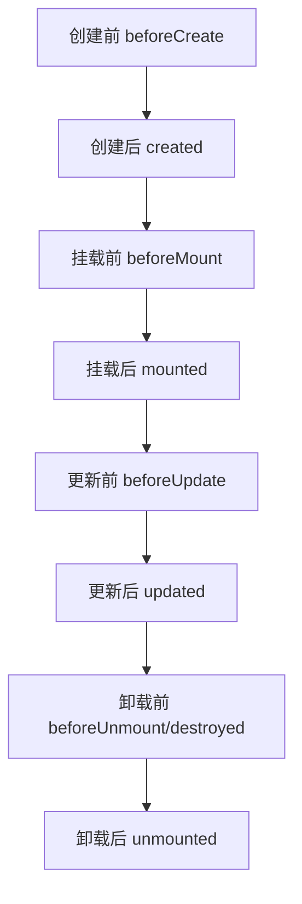

# Vue3生命周期与钩子函数

> 本章系统梳理Vue3的生命周期流程、各生命周期钩子的作用与用法，涵盖Options API与Composition API的对比，配合实战代码、性能分析和面试高频考点，帮助你全面掌握Vue3组件生命周期。

## 面试常见问题

### 1. Vue3中Options API和Composition API的生命周期钩子如何对应？

**答**：Vue3中Options API与Composition API的生命周期钩子存在一一对应关系，具体如下：

| Options API钩子   | Composition API钩子   | 说明                     |
|-------------------|-----------------------|--------------------------|
| beforeCreate      | -                     | 被`setup()`替代           |
| created           | -                     | 被`setup()`替代           |
| beforeMount       | -                     | 无对应钩子，逻辑可前置到`setup()` |
| mounted           | onMounted             | 组件挂载后执行            |
| beforeUpdate      | onBeforeUpdate        | 组件更新前执行            |
| updated           | onUpdated             | 组件更新后执行            |
| beforeUnmount     | onBeforeUnmount       | 组件卸载前执行            |
| unmounted         | onUnmounted           | 组件卸载后执行            |

### 2. 为什么Composition API不再提供beforeCreate和created钩子？

**答**：Composition API通过`setup()`函数统一处理组件初始化逻辑，`setup()`在组件实例创建之前执行（早于beforeCreate），因此无需单独的beforeCreate和created钩子。所有数据初始化、异步请求等逻辑均可在`setup()`中完成，使代码更集中、易维护。

### 3. 如何在生命周期钩子中正确清理副作用？

**答**：对于定时器、事件监听等副作用，应在`onBeforeUnmount`或`onUnmounted`钩子中清理，避免内存泄漏。示例：

```javascript
import { onBeforeUnmount } from 'vue'

setup() {
  const timer = setInterval(() => {
    console.log('定时任务')
  }, 1000)

  onBeforeUnmount(() => {
    clearInterval(timer) // 清理定时器
  })
}
```

## 概念介绍

生命周期（Lifecycle）是指Vue组件从创建、挂载、更新到卸载的完整过程。每个阶段Vue都提供了相应的钩子函数（Hook），开发者可以在这些钩子中执行特定逻辑，如数据初始化、异步请求、事件监听、资源清理等。

Vue3生命周期钩子分为两大类：
- **Options API钩子**：如`created`、`mounted`、`updated`、`destroyed`等
- **Composition API钩子**：如`onMounted`、`onUpdated`、`onUnmounted`等

掌握生命周期的流程和各钩子的作用，是编写高质量Vue组件的基础。

## 生命周期流程图



## 生命周期阶段与钩子说明

> 注：Composition API不再区分beforeCreate/created，统一在`setup`中完成初始化。

| 阶段         | Options API钩子      | Composition API钩子   | 典型用途                   |
|--------------|----------------------|-----------------------|----------------------------|
|--------------|----------------------|-----------------------|----------------------------|
| 创建前       | beforeCreate         | -                     | 初始化前的准备（此时data和methods未初始化） |
| 创建后       | created              | -                     | 数据初始化、异步请求（此时data已初始化） |
| 挂载前       | beforeMount          | -                     | 渲染前的DOM操作（虚拟DOM未挂载） |
| 挂载后       | mounted              | onMounted             | DOM操作、第三方库初始化（真实DOM已渲染） |
| 更新前       | beforeUpdate         | onBeforeUpdate        | 更新前的状态保存（虚拟DOM更新前） |
| 更新后       | updated              | onUpdated             | DOM更新后的操作（真实DOM已更新） |
| 卸载前       | beforeUnmount        | onBeforeUnmount       | 清理定时器、事件监听（组件即将卸载） |
| 卸载后       | unmounted            | onUnmounted           | 彻底清理资源（组件已卸载） |

> 注：Composition API不再区分beforeCreate/created，统一在`setup`中完成初始化。

## 兼容性说明

Vue3生命周期钩子在现代浏览器（Chrome 64+, Firefox 67+, Safari 12.1+, Edge 79+）中完全支持。对于旧版浏览器（如IE11），需配合`@vue/compat`兼容包使用，但部分Composition API钩子（如onRenderTracked）可能无法完全兼容。